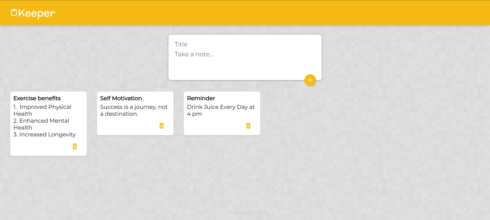
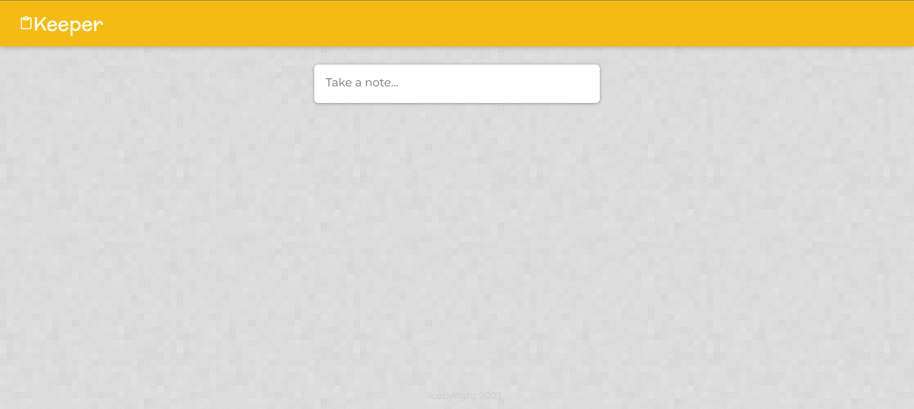
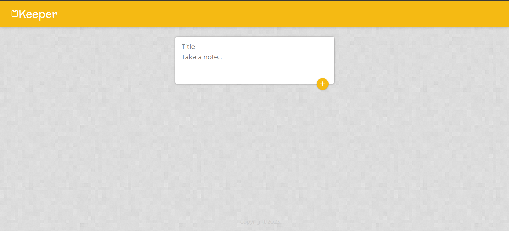

# Keeper-App in React

This is a React project its a simple app for adding notes. In this, you can add or delete the notes with animation and other stuff.

### Screenshot

| Main Page                                                       |
| --------------------------------------------------------------- |
|  |

| Starting State of the page                                                 | Clicked State of the page                                                           |
| -------------------------------------------------------------------------- | ----------------------------------------------------------------------------------- |
|  |  |

## process

### Built with

-   HTML5
-   CSS custom properties
-   JavaScript
-   [React](https://reactjs.org/) - JS library

### New Thing's Learned

-   Filter function
-   Pre-state functionality
-   Get more familiar with the useState hook
-   Introduction to Material UI
